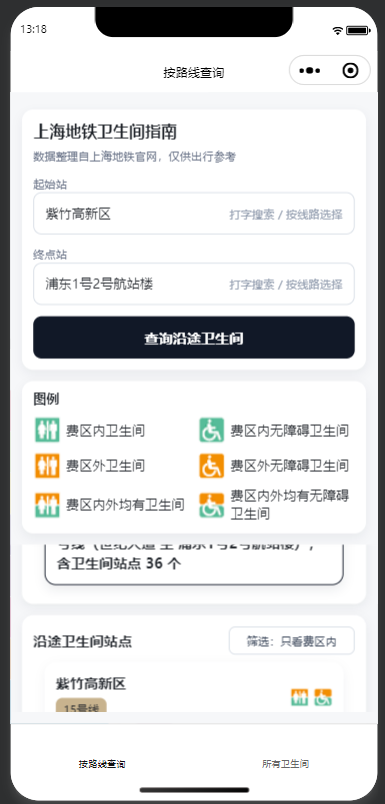
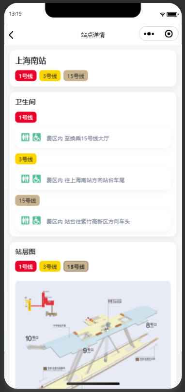
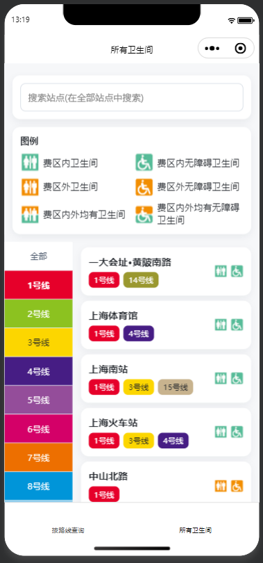

# Metro厕所攻略（微信小程序 - Codex开发）

## 项目介绍

**Metro厕所攻略** 是一款围绕上海地铁真实出行场景设计的微信小程序，由本人独立完成，并借助 Codex 快速搭建 MVP。

### 目标

针对上海地铁卫生间信息分散、沿途分布难判断、到站难找和换乘站指引不足等痛点，设计面向真实出行场景的查询小程序，降低用户的信息检索与决策成本。

### 过程

梳理上海地铁官网、Metro 大都会等现有信息来源与竞品方案，围绕用户“出发前查询 - 途中判断 - 到站定位”的决策链路，设计了按路线查询、全网/分线路浏览、站点搜索、站点详情查看等基础功能，并集成了沿途卫生间识别、费区内外筛选、换乘站多线路整合、站层图切换查看等关键能力，随后借助 Codex 快速完成小程序 MVP 搭建。

### 成果

小程序待审核通过后上线，现可试用：[https://github.com/xuyira/ai4WC](https://github.com/xuyira/ai4WC)。项目验证了公开信息产品化与 AI 协同开发的可行性，体现了需求洞察、方案抽象和快速落地能力。

## 页面截图展示

  
  
  

